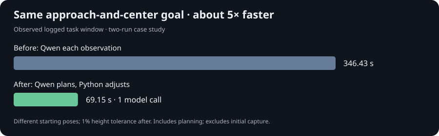
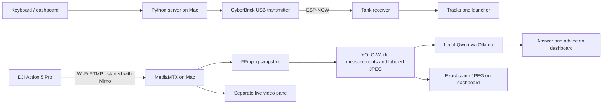

# Rook the Rover

**A small tank learning to see, then navigate.**

Rook is a rover proof of concept built around a 3D-printed CyberBrick Mini-T
tank, a DJI camera, and a local vision-language model running on a Mac.
Keyboard control and live video work today. Qwen interprets navigation goals; a detector and Python controller run the
short move/observe loop without a model call for each adjustment.

> Current mode: **manual driving + local vision + optional navigation goal**.
> Click Start goal to enable bounded automatic turns; Stop cancels the run.

## A measured speed improvement

The same approach-and-center goal completed in a **69-second logged window,
down from 346 seconds** after moving repeated adjustments into a Python visual
feedback controller. Qwen calls fell **21 → 1**, and observations **21 → 14**.



This is a two-run POC case study with different starting poses and a 1% height
tolerance in the new controller, not a controlled benchmark.
[See the measurements, architecture, and limitations](docs/PERFORMANCE.md).

Project notes: [current status](docs/STATUS.md) · [prompts](docs/PROMPTS.md) ·
[ideas](docs/IDEAS.md) · [workspace layout](docs/WORKSPACE.md).

## Shooting prototype and local simulation

One-shot missions now align, stop, issue a bounded fire/reset command and
record evidence. Physical impact verification remains **unconfirmed**; the
current trained adapter still refuses firing. No autonomous physical firing
test has been performed.

The **MuJoCo playground at localhost:8002** runs toy projectile physics and
reports actual simulated contact. Four scripted mission paths and 100
deterministic hit/miss cases pass. It uses ideal segmentation and uncalibrated
physics; these results do not establish physical-tank reliability.
[Setup, prompts, tests and limitations](docs/SHOOTING_SIMULATION.md).

## What works today

- Hold-to-drive keyboard control over a USB transmitter and ESP-NOW.
- Turn-in-place search that finds the red can, centers it, and confirms full visibility; physically tested successfully.
- Wireless DJI capture and live video plus an exact Qwen-input view in a localhost dashboard.
- Target-box overlay, crosshair, image grid, offset/size measurements, snapshot age, and target-position trail.
- Local **Qwen3-VL 4B Instruct** image analysis through Ollama.
- Visual questions such as: *“Find the Coca-Cola can. Is it left, centre, or right?”*
- Analyzed snapshot, direct answer, movement suggestion, reasoning, and uncertainty.
- Optional navigation goal: short movement steps followed by stop and observation.
- Qwen goal planning with detector-driven feedback control and bounded adaptive movements.
- Coordinate-based centering and bounding-box size checks for percentage-height approach goals.
- Manual launcher elevation and firing.
- Signed receiver application updates with verification and rollback.

## How it fits together



The Mac handles video and model inference. CyberBrick handles motors and servos.
The vision path uses snapshots rather than sending every video frame to the model.
No cloud model or paid API key is needed for the current POC.

## Offline testing and training preparation

No rover required: `python3 rover_playground.py`, then open
[localhost:8001](http://localhost:8001). Test the production Qwen planner on
saved labeled frames, correct its plans, and export reviewed training examples.
This does not open serial ports, train a model, or simulate physical motion.
A first local QLoRA adapter improved held-out planner contracts from **12/28
to 25/28** on four recorded scenes. The trained model is selectable in the
playground; three missing-target failures remain. The tank runtime still uses
the original Ollama model. See [the playground guide](docs/PLAYGROUND.md) and
[the local QLoRA experiment and limits](docs/FINE_TUNING.md).

## Hardware

| Component | Role |
| --- | --- |
| CyberBrick Mini-T tank | Working rover platform with two tracks and launcher |
| CyberBrick transmitter | USB connection to the Mac; ESP-NOW radio link |
| CyberBrick receiver | Battery-powered motor and servo control |
| DJI Osmo Action 5 Pro | Live camera |
| Phone with DJI Mimo | Starts the wireless camera livestream |
| MacBook Air M4, 16 GB RAM | Dashboard, video services, and local inference |

Photos will be added as the project develops.

## Run the current POC

This repository captures an existing, configured hardware setup. **It is not a
plug-and-play installer for a new CyberBrick kit.** Receiver addresses, serial
ports, and the video host address currently reflect the development setup.

### 1. Install Mac dependencies

```sh
brew install ollama ffmpeg
python3 -m venv .venv
source .venv/bin/activate
pip install -r requirements.txt
```

Install [MediaMTX](https://github.com/bluenviron/mediamtx/releases) separately.
Its binary is not included in this repository.

### 2. Start the local model

```sh
ollama serve
```

In another terminal:

```sh
ollama pull qwen3-vl:4b-instruct
```

Use the explicit **4b-instruct** tag. The default `qwen3-vl:4b` tag resolves to
the thinking variant and exhausted the response budget in our camera tests.
Ollama listens locally at `http://127.0.0.1:11434`.

### 3. Start the camera stream

```sh
cp tank_camera.example.yml tank_camera.yml
mediamtx tank_camera.yml
```

Start an RTMP livestream in DJI Mimo using:

```text
rtmp://<MAC_LAN_IP>:1935/live/tank
```

Allow incoming camera connections if macOS prompts. The example RTMP listener
binds all interfaces so the camera can reach it over the LAN; the management API
and browser viewer bind localhost. The local network should be trusted.

Update the RTMP address in `rover_vision.py` to your Mac's LAN IP. Its current
value is specific to the working development setup. Standalone video is at
`http://localhost:8889/live/tank/`.

### 4. Start tank controls

Power the tank from its battery and connect the transmitter to the Mac over USB.
Close Thonny and other applications holding the serial port.

```sh
python3 -m serial.tools.list_ports -v
python3 -u server_tank.py
```

Check `PORT` and the receiver peer address in `server_tank.py` before running
on different hardware. The server requires the existing **32-byte
`.tank_update.key`** beside the scripts, matching the key already installed on
the receiver. This private file is intentionally excluded from Git. Generating
a different key does not reconnect an already configured receiver.

Open **http://localhost:8000**.

### 5. Start a navigation goal

The top pane shows live video (about one second of delay). The bottom pane
shows the exact labeled planner or controller input, verified by SHA-256.
It explicitly identifies whether Qwen is analyzing that frame or the Python
controller is using it without a Qwen call. The browser adds no annotations.
Detector scores are not calibrated probabilities; arbitrary targets remain unvalidated.

Install the detector in a separate Python 3.12 environment beside the server:

```sh
python3.12 -m venv .detector-venv
.detector-venv/bin/pip install -r experiments/requirements.txt
mkdir -p tools
```

Place official `yolov8s-worldv2.pt` weights in `tools/`. The worker starts and
warms up automatically before capture; first use may download CLIP weights.
Weights and camera images are excluded from Git.

Enter a goal in the empty **Navigation goal** box, then click **Start**.
For example: “Turn until the red can is centred in the image, then stop.”
Qwen interprets the goal once into a target and visual setpoint. Supported goals
are finding a target by turning in place, centering, or approaching to an explicit percentage of image height while
centered. Python then measures each fresh frame, aligns before advancing, and
estimates movement duration from actual changes after previous movements.
Initial cautious pulses (150 ms turning, 250 ms forward) establish movement gain;
subsequent pulses adapt within 50–1000 ms. Reversing a turn after overshooting
halves the previous pulse. Approach alignment starts loose (up to ±15% image-width offset when far
away), tightens with apparent size, and uses ±5% at completion with a 1%
image-height tolerance; oversize centered targets stop rather than reversing.

Target loss or three stalled adjustments stops movement and requests Qwen review,
with at most two reviews per goal. Missing video, clipping during approach,
wrong-way turns, old observations, errors, Stop, and the 40-step limit remain
stop conditions. Firing, reverse travel, and physical distance goals
are not supported by this fast controller. No obstacle avoidance is implemented.

Moves retain the receiver watchdog and 1.5 second video settling wait. This
avoids waiting for Qwen after every correction, but camera capture and stream
delay still limit reaction speed. **Stop** cancels the run; leaving the page
and arrow keys do not interrupt autonomy. Real-world performance needs testing.

A terminal-only assessment is also available:

```sh
python3 rover_vision.py --goal "Find a clear path ahead."
```

## Find a target by rotating in place

**Status:** successfully tested on the physical tank after the full-power pivot
and find-and-center corrections (October 2, 2026). Exact 360° coverage remains
uncalibrated; this confirms the search-and-center behavior, not heading accuracy.

Enter **“Find the red can by doing 360 turn in place”** and press Start.
Qwen selects the target and search mode once. Python turns right in 250 ms
pulses, stops, waits for fresh video, and checks the detector. It switches from searching to
centering as soon as a candidate appears. Success requires a fully visible,
centered target confirmed in two stationary frames. It does not approach or fire;
request an approach goal afterward.

An exact full turn cannot be inferred from motor time without calibration.
The dashboard explicitly shows **360° not calibrated; bounded search** by
default. Search stops without claiming success after 9.75 seconds of commanded
rotation or the global 40-observation limit. This limit does not guarantee a
full circle, and targets between sampled viewpoints can be missed.

If measured on the actual tank, surface, and current autonomous speed, set
`ROOK_FULL_TURN_MS` to the motor-on duration for one full turn (250–9500 ms)
when starting the server. That provides a timed 360° estimate, not heading
feedback; traction and battery changes can affect it. Search turns use 100% power on both tracks (mirrored motor wiring), rather
than the previous 40% setting; approach remains at 40%. Calibration must be
measured at this turn power. The scan stops early when the target is found
and then centers it. No calibration is assumed or invented.

## Search, center, and approach in one goal

Use:

> Find the red can by turning in place. Center it, then move closer until it
> occupies roughly 50% of the image height. Keep it centered, then stop.

Qwen creates one `find_approach_size` plan with the requested height. The
controller searches in place, roughly aligns a fully visible distant candidate,
confirms it in two stationary frames, then takes a fresh observation before
approaching. It tightens alignment as apparent target size increases, retaining
the ±5% final centering requirement. The current alignment tolerance is shown
on the dashboard.
Search confirmation does not complete this mission: completion requires the
requested apparent size and centering tolerance. Target loss, clipping,
Stop, search budgets, watchdogs, and the global 40-step limit still apply.
One missed detector frame during combined approach stops movement and retries
while stationary. After two missed retries, bounded reacquisition resumes using
the accepted target and setpoint. It does not reinterpret the mission through
Qwen for this expected recovery; ambiguous targets still stop.
The allowed planner schema preserves explicit search and percentage-height
requirements; it cannot silently return a find-only plan for this prompt.
Unsupported firing or reverse goals continue to fail explicitly.

The combined sequence has unit coverage and a successful real local Qwen
planning check with a saved absent-target frame. Physical combined-goal
validation is pending; its component search and approach flows were tested
separately on the tank.

## Controls

| Input | Action |
| --- | --- |
| Hold ↑ / ↓ | Forward / backward |
| Hold ← / → | Turn left / right |
| Release driving key | Stop tracks |
| Hold 1 / 2 | Launcher up / down |
| Hold Space | Fire; release resets |
| Escape | Stop driving and reset launcher controls |

The receiver stops drive commands after a 500 ms heartbeat timeout. Launcher
controls have their own timeout. Forward/reverse includes the tested approximately
18% reduction on the left track to compensate for ground drift.

## What we have verified

- Local model recognized a synthetic red square.
- Real DJI frame analysis completed in about **10–12 seconds** on the M4 Mac.
- It identified a Coca-Cola can on the **right** of the image.
- It suggested STOP for an obscured camera frame.
- Tank status remained responsive during background analysis.

These are initial POC observations, not a navigation reliability benchmark.
Wireless video has approximately **one second of delay**. Bounded navigation control is implemented; physical turn accuracy is pending
user testing. Obstacle avoidance and camera-to-launcher aiming calibration
are not implemented yet. The original physical remote has not been verified as
a fallback with the custom receiver application.

## Roadmap

| Phase | Goal | Status |
| --- | --- | --- |
| 1 | Keyboard rover control | Working |
| 2 | Camera feed and driving dashboard | Working POC; mounting/range validation continues |
| 3 | Obstacle avoidance | Pending |
| 4 | LLM-directed autonomous tasks | Visual questions verified; navigation controller ready for physical testing |

Next: test the bounded navigation turns on the tank and verify that it stops
when the target is centred. Navigation will use **move → stop → observe**, with explicit Stop control, before attempting more complex missions.

A HAIBOXING truck conversion and drone camera reuse were investigated and are
paused while we focus on the working tank POC. See [project status](docs/STATUS.md).

## Target POC mission

**Scan 360° quickly → identify the Coca-Cola can → approach → centre and aim → shoot.**

The current shooting stage supports **one attempt per mission**, with up to
six automatic attempts before reload acknowledgment. It is implemented and
tested in simulation; physical validation remains pending. Calibrated scan
rotation, physical approach distance, launcher elevation/range and automatic
hit verification remain future work. See [project status](docs/STATUS.md).

## Code map

| File | Purpose |
| --- | --- |
| `server_tank.py` | Local controls, USB bridge, and background vision endpoints |
| `rover_dashboard.html` | Live video, manual controls, and model results |
| `rover_vision.py` | RTMP frame capture and local Qwen assessment |
| `rover_autonomy.py` | Bounded navigation loop with cancellation and browser lease |
| `test_rover_autonomy.py` | Tests for stop, cancellation, stale observations, and step limits |
| `tank_app.py` | Receiver application: track calibration and launcher control |
| `rover_shooting.py` | Bounded fire/reset and persistent automatic-attempt accounting |
| `simulation/` | MuJoCo camera playground, projectile physics and tests |
| `tank_wireless_service.py` | ESP-NOW receiver, watchdog, signed updates, and rollback |
| `wireless_update.py` | Host-side signed application uploader |
| `install_wireless_updates.py` | Existing receiver-specific USB provisioning script |
| `tank_camera.example.yml` | MediaMTX configuration template |

The provisioning script is specific to the original receiver and verifies its
MAC address. Its hard-coded USB port may now identify the transmitter: inspect
and adjust it before any provisioning. It modifies Python files on the receiver
and is **not** a firmware flashing tool. See [wireless updates](docs/WIRELESS_UPDATES.md).

**Do not flash CyberBrick firmware with third-party tools.** Keep the vendor's
locked MicroPython firmware and preserve original receiver files before changes.

## References

- [CyberBrick API documentation](https://makerworld.com/en/cyberbrick/api-doc/)
- [Mini-T tank model](https://makerworld.com/en/models/1734120-cyberbrick-mini-t-remote-controlled-mini-tank)
- [Qwen3-VL models on Ollama](https://ollama.com/library/qwen3-vl)
- [MediaMTX](https://github.com/bluenviron/mediamtx)
- [LLM Vision](https://llmvision.org/) — saved inspiration; Home Assistant integration, not a current dependency.
