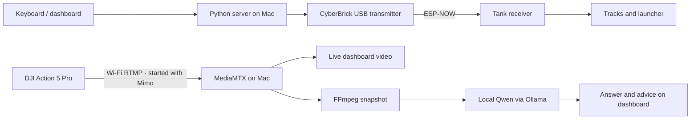

# Rook the Rover

**A small tank learning to see, then navigate.**

Rook is a rover proof of concept built around a 3D-printed CyberBrick Mini-T
tank, a DJI camera, and a local vision-language model running on a Mac.
Keyboard control and live video work today. Qwen can inspect a camera snapshot
and answer questions about the scene; autonomous driving is the next milestone.

> Current mode: **manual driving + local visual question answering**.
> Model suggestions are displayed, not executed.

## What works today

- Hold-to-drive keyboard control over a USB transmitter and ESP-NOW.
- Wireless DJI video beside the controls in a localhost dashboard.
- Local **Qwen3-VL 4B Instruct** image analysis through Ollama.
- Visual questions such as: *“Find the Coca-Cola can. Is it left, centre, or right?”*
- Analyzed snapshot, direct answer, movement suggestion, reasoning, and uncertainty.
- Manual launcher elevation and firing.
- Signed receiver application updates with verification and rollback.

## How it fits together



The Mac handles video and model inference. CyberBrick handles motors and servos.
The vision path uses snapshots rather than sending every video frame to the model.
No cloud model or paid API key is needed for the current POC.

## Hardware

| Component | Role |
| --- | --- |
| CyberBrick Mini-T tank | Working rover platform with two tracks and launcher |
| CyberBrick transmitter | USB connection to the Mac; ESP-NOW radio link |
| CyberBrick receiver | Battery-powered motor and servo control |
| DJI Osmo Action 5 Pro | Live camera |
| Phone with DJI Mimo | Starts the wireless camera livestream |
| MacBook Air M4, 16 GB RAM | Dashboard, video services, and local inference |

Photos will be added as the project develops.

## Run the current POC

This repository captures an existing, configured hardware setup. **It is not a
plug-and-play installer for a new CyberBrick kit.** Receiver addresses, serial
ports, and the video host address currently reflect the development setup.

### 1. Install Mac dependencies

```sh
brew install ollama ffmpeg
python3 -m venv .venv
source .venv/bin/activate
pip install -r requirements.txt
```

Install [MediaMTX](https://github.com/bluenviron/mediamtx/releases) separately.
Its binary is not included in this repository.

### 2. Start the local model

```sh
ollama serve
```

In another terminal:

```sh
ollama pull qwen3-vl:4b-instruct
```

Use the explicit **4b-instruct** tag. The default `qwen3-vl:4b` tag resolves to
the thinking variant and exhausted the response budget in our camera tests.
Ollama listens locally at `http://127.0.0.1:11434`.

### 3. Start the camera stream

```sh
cp tank_camera.example.yml tank_camera.yml
mediamtx tank_camera.yml
```

Start an RTMP livestream in DJI Mimo using:

```text
rtmp://<MAC_LAN_IP>:1935/live/tank
```

Allow incoming camera connections if macOS prompts. The example RTMP listener
binds all interfaces so the camera can reach it over the LAN; the management API
and browser viewer bind localhost. The local network should be trusted.

Update the RTMP address in `rover_vision.py` to your Mac's LAN IP. Its current
value is specific to the working development setup. Standalone video is at
`http://localhost:8889/live/tank/`.

### 4. Start tank controls

Power the tank from its battery and connect the transmitter to the Mac over USB.
Close Thonny and other applications holding the serial port.

```sh
python3 -m serial.tools.list_ports -v
python3 -u server_tank.py
```

Check `PORT` and the receiver peer address in `server_tank.py` before running
on different hardware. The server requires the existing **32-byte
`.tank_update.key`** beside the scripts, matching the key already installed on
the receiver. This private file is intentionally excluded from Git. Generating
a different key does not reconnect an already configured receiver.

Open **http://localhost:8000**.

### 5. Ask the camera a question

Enter a question, then click **Analyze camera frame**. For example:

> Find the Coca-Cola can. Is it left, centre, or right in the image?

The dashboard captures a frame, asks local Qwen, and displays the answer.
Observation questions request a STOP movement suggestion. You retain control.
Snapshots and assessments are saved locally in `vision-output/`, excluded from Git.

A terminal-only assessment is also available:

```sh
python3 rover_vision.py --goal "Find a clear path ahead."
```

## Controls

| Input | Action |
| --- | --- |
| Hold ↑ / ↓ | Forward / backward |
| Hold ← / → | Turn left / right |
| Release driving key | Stop tracks |
| Hold 1 / 2 | Launcher up / down |
| Hold Space | Fire; release resets |
| Escape | Stop driving and reset launcher controls |

The receiver stops drive commands after a 500 ms heartbeat timeout. Launcher
controls have their own timeout. Forward/reverse includes the tested approximately
18% reduction on the left track to compensate for ground drift.

## What we have verified

- Local model recognized a synthetic red square.
- Real DJI frame analysis completed in about **10–12 seconds** on the M4 Mac.
- It identified a Coca-Cola can on the **right** of the image.
- It suggested STOP for an obscured camera frame.
- Tank status remained responsive during background analysis.

These are initial POC observations, not a navigation reliability benchmark.
Wireless video has approximately **one second of delay**. Automated movement,
obstacle avoidance, target centering, and camera-to-launcher aiming calibration
are not implemented yet. The original physical remote has not been verified as
a fallback with the custom receiver application.

## Roadmap

| Phase | Goal | Status |
| --- | --- | --- |
| 1 | Keyboard rover control | Working |
| 2 | Camera feed and driving dashboard | Working POC; mounting/range validation continues |
| 3 | Obstacle avoidance | Pending |
| 4 | LLM-directed autonomous tasks | Visual question answering working; automated motion pending |

Next: verify object position across several views, then test short bounded turns
that center a target. Navigation will use **move → stop → observe**, with manual
override, before attempting more complex missions.

A HAIBOXING truck conversion and drone camera reuse were investigated and are
paused while we focus on the working tank POC. See [project status](docs/STATUS.md).

## Code map

| File | Purpose |
| --- | --- |
| `server_tank.py` | Local controls, USB bridge, and background vision endpoints |
| `rover_dashboard.html` | Live video, manual controls, and model results |
| `rover_vision.py` | RTMP frame capture and local Qwen assessment |
| `tank_app.py` | Receiver application: track calibration and launcher control |
| `tank_wireless_service.py` | ESP-NOW receiver, watchdog, signed updates, and rollback |
| `wireless_update.py` | Host-side signed application uploader |
| `install_wireless_updates.py` | Existing receiver-specific USB provisioning script |
| `tank_camera.example.yml` | MediaMTX configuration template |

The provisioning script is specific to the original receiver and verifies its
MAC address. Its hard-coded USB port may now identify the transmitter: inspect
and adjust it before any provisioning. It modifies Python files on the receiver
and is **not** a firmware flashing tool. See [wireless updates](docs/WIRELESS_UPDATES.md).

**Do not flash CyberBrick firmware with third-party tools.** Keep the vendor's
locked MicroPython firmware and preserve original receiver files before changes.

## References

- [CyberBrick API documentation](https://makerworld.com/en/cyberbrick/api-doc/)
- [Mini-T tank model](https://makerworld.com/en/models/1734120-cyberbrick-mini-t-remote-controlled-mini-tank)
- [Qwen3-VL models on Ollama](https://ollama.com/library/qwen3-vl)
- [MediaMTX](https://github.com/bluenviron/mediamtx)
- [LLM Vision](https://llmvision.org/) — saved inspiration; Home Assistant integration, not a current dependency.
