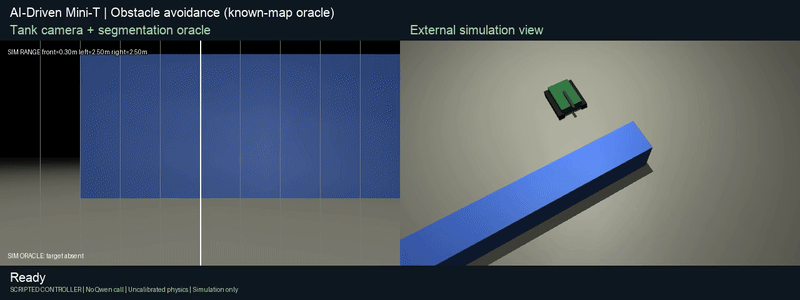

# Obstacle avoidance: simulation milestone

The first avoidance controller is implemented and tested in MuJoCo. It routes
around static blocks, approaches the red can, faces it and stops. It never
fires. This is a navigation baseline, not model training or camera perception.

## Try it

Open http://localhost:8002 and choose **Block ahead**, **Left route open**,
**Right route open**, **Wall hiding target**, or **Both routes blocked**.
Scene selection resets the tank and places the can 1.2 m ahead. Click
**Avoid & approach · map oracle**. Stop cancels the run; Clear and Reset return
to the existing search/approach/shoot missions.

The upper view is the simulated tank camera. The lower view is an explicitly
labeled, known-map overhead view while obstacles are enabled. Displayed range
readings are ideal simulated measurements, not camera-derived distances.
The ordinary goal text box and Start button retain the existing mission
planner; the dedicated avoidance button runs a fixed task without Qwen.

If the server is stopped, from the repository run:

```sh
.sim-venv/bin/python simulation/server.py
```

## How it works

- A* plans on a 5 cm grid in a bounded workspace using the entire known map.
- Obstacles are inflated by a 16 cm tank/launcher footprint and 5 cm planning
  margin. Routes are shortened only along checked clear segments.
- The tank pivots toward each waypoint, then advances. Durations follow remaining
  angle/distance and illustrative simulator speeds, capped at 400 ms per move.
- A separate guard checks every translation substep for at least 3 cm clearance.
  Unsafe movement stops before committing the position. Turns use the same
  conservative disk footprint, which encloses the launcher in every heading.
- The destination is 35 cm behind the simulated can's world position. This
  fixed simulation standoff is not a requested image-size goal or real calibration.
- No route, a clearance guard or the 120-step limit stops the mission.
- Eight ideal ray readings cover the surrounding static rectangles, up to
  2.5 m from the footprint edge. They exclude the can and do not drive routing;
  planning uses the complete map, tank pose and can location directly.

MuJoCo signed geometry distances check tank/launcher overlaps independently of
the route geometry. A forced overlap at the far end of a wall verifies this
monitor detects collisions. Mocap/static pairs are excluded from automatic
contact generation, so the monitor explicitly queries the narrow-phase geometry.
Track motion remains kinematic; no slip, localization error or sensor noise is
modeled. Planning clearance includes extra room for waypoint tracking error.
Starting avoidance preserves the ammunition ledger; Reset explicitly reloads.

## Evidence — 2026-10-04

[Machine-readable results](obstacle-simulation-results.json) contain all 100
cases, including starting distance, lateral offset, heading, steps, minimum
clearance, terminal state and actual contact count.

| Check | Result |
| --- | --- |
| Varied obstacle missions | 100/100 passed |
| Reachable detours | 80/80 reached |
| Enclosed tank | 20/20 stopped without motion |
| Obstacle contacts | 0 |
| Clearance guard stops in reachable matrix | 0 |
| Unit tests | 20 passed: 10 obstacle + 10 physics |
| Host regressions | 79 passed |
| Scripted browser checks | 19 passed |

Additional guard tests deliberately drive forward/backward into blocks, verify
safe pivoting, reject invalid scenes, and reject goals inside inflated obstacles.
The report also records existing launcher and mission HTTP regression checks.
These fixtures are deterministic and selected; they are not universal reliability
or Qwen perception benchmarks.



[MP4](assets/obstacle-avoidance-simulation.mp4) ·
[Recording outcomes](assets/obstacle-avoidance-simulation.json).
The recording uses the scripted known-map controller and no Qwen calls.

## Reproduce

```sh
cd simulation
../.sim-venv/bin/python -m unittest test_sim test_obstacles
../.sim-venv/bin/python obstacle_matrix.py
cd ..
node simulation/browser_test.mjs
python3 simulation/launcher_http_test.py
python3 simulation/http_matrix.py
.sim-venv/bin/python simulation/record_obstacle_demo.py
```

Browser/HTTP checks require localhost:8002; run them sequentially because they
reset and control the same simulated tank. Rendering requires macOS graphics
access. Generated browser logs remain private; published results are synthetic.

## Next milestone

Replace perfect-map inputs with independently measured obstacles and estimated
pose. Then test noise, unseen layouts, narrow passages and moving obstacles.
Camera-only distance estimates or a real range sensor need separate validation;
none has been connected to the physical tank here. Qwen can choose a mission,
while a fast navigation layer handles clearance and routing. Training is not
needed to establish this baseline, and no fine-tuning was performed for it.
