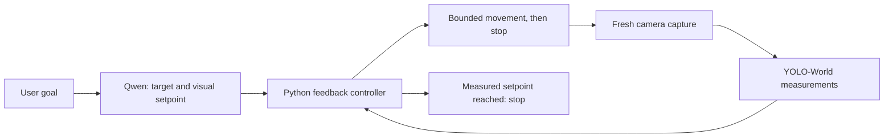

# From one model call per move to one model call per goal

On October 2, 2026, Rook completed the same physical approach-and-center goal
with a **5× shorter logged window**, using **one Qwen call instead of 21**.
These are two successful runs, not a controlled benchmark or a general speed guarantee.

## The goal

> Move closer to the red can until it occupies roughly 50% of the image height.
> Keep it centered, then stop.

| Measurement | Before: Qwen every observation | After: Qwen planner + visual controller |
| --- | ---: | ---: |
| Logged task window¹ | 346.43 s (5 min 46 s) | 69.15 s (1 min 9 s) |
| Observation steps | 21 | 14 |
| Qwen calls | 21 | 1 |
| Model-call timing | 13.03 s mean per call² | 11.44 s for the initial plan |
| Detector/controller observation, including live capture | Not measured separately | 2.11 s mean; no Qwen call |
| Final can height | 50.1% | 49.0% |
| Final center offset | 2.5 percentage points left | 1.35 percentage points left |
| Result | Goal achieved; stopped | Goal achieved; stopped |

¹ First captured frame timestamp to the final saved result timestamp. Includes
initial planning in the new run, subsequent capture, inference/control, settling,
and movement. Excludes startup and capture of the first frame; it is not an
exact Start-button-to-stop stopwatch measurement.

² The old `inference_seconds` includes detector preparation and Qwen processing.
The new planner timing measures the Qwen request after labeling; these timings
are reported as logged, rather than treated as identical isolated model benchmarks.

## What changed

Previously, every correction needed image labeling, Qwen inference, a timed
movement, and another observation. Most time was spent waiting for the model.

Now Qwen converts the goal into a target and image-size setpoint once. Python
uses fresh YOLO-World measurements to center and approach the target. It learns
movement response from actual changes in position and apparent size, adapts
pulse duration, and shortens reversed turns after overshooting. Movement still
stops between observations. Missing targets or stalled progress can trigger
bounded Qwen review; this successful run required none.

The improvement comes from removing model inference from each correction,
not from making Qwen itself faster. Capture and camera delay remain bottlenecks.

## What this comparison does and does not establish

- Logged duration dropped about **80%**, steps **33%**, and model calls **95%**.
- Initial can heights were similar: 35.3% before and 34.6% after.
- Initial alignment differed: 9.75 percentage points left before versus 32.85 after.
  Tank pose, lighting, battery state, and other conditions were not controlled.
- The new controller accepts a one-percentage-point height tolerance, so 49.0%
  satisfies the roughly 50% goal. The previous check required at least 50%.
  Both runs used a five-percentage-point centering tolerance.
- Results use detector image measurements, not calibrated physical distance.
- A single pair of successful runs supports this case study; repeated trials
  would be needed for claims about reliability or typical speed.
- Receiver watchdog, explicit Stop, stale-frame checks, wrong-way turn checks,
  clipping checks during approach, and step bounds remain in place. This is a
  supervised POC without obstacle avoidance or autonomous firing.

Aggregate measurements are available in [optimization-results.json](optimization-results.json).
Source revisions: [before](https://github.com/ameyarya/rook-the-rover/commit/3a81291)
and [after](https://github.com/ameyarya/rook-the-rover/commit/7038b30).
The underlying local JSON logs were checked against the completed dashboard
status. Camera images and raw private logs remain local.
